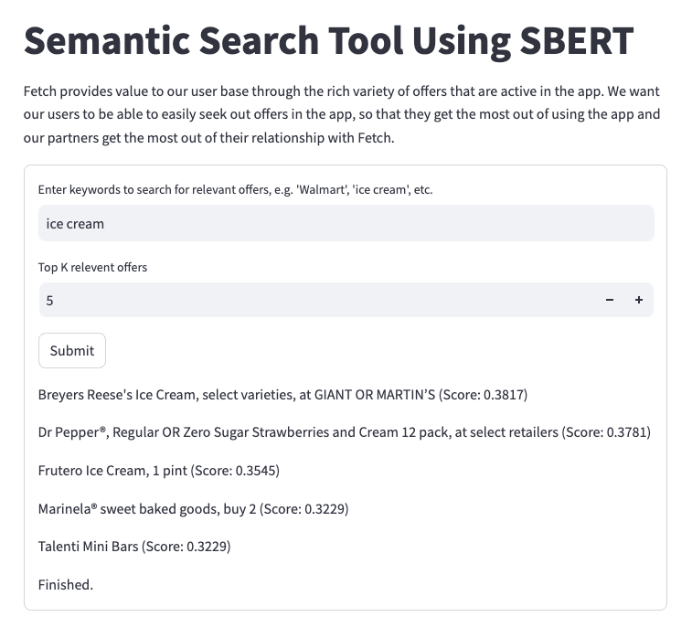

# Data Science Take-Home Challenge

## Introduction

Fetch's goal is to provide value to its users by enabling them to discover and access a variety of offers through their platform. The objective of this assignment was to create a tool that enables users to intelligently search for offers by providing text input. To achieve this, a Semantic Search model was utilized to search for relevant offers based on user-provided keywords, such as categories, brands, or retailers.

## Solution

The solution to this challenge involved the following key steps:

1. **Data Preparation:** Three datasets were provided - one containing offers and associated metadata, and the others containing brands and their corresponding categories. These datasets were used to train and build the Semantic Search model.

2. **Semantic Search Model:** A Semantic Search model was employed to find relevant offers based on the user's search input. The model was fine-tuned on the provided datasets to understand the semantic context of offers, brands, and categories.

3. **Search Functionality:** The tool was designed to accept user text input, allowing users to search for categories (e.g., "diapers"), brands (e.g., "Huggies"), or retailers (e.g., "Target"). The tool then queried the Semantic Search model to find offers related to the user's input.

4. **Similarity Score:** The tool not only returned relevant offers but also provided a similarity score for each offer. This score measured how closely the offer matched the user's query, enhancing the user's understanding of the search results.

5. **Deployment:** The tool was deployed for ease of use and a seamless user experience. You chose to host the model on Hugging Face's Spaces platform, making it accessible through a web interface.

## Model Deployment

The Semantic Search tool was deployed on Hugging Face's Spaces platform, making it readily available for users to access. Users can utilize the tool through a web interface by visiting the following URL: [Semantic Search Tool](https://huggingface.co/spaces/hbbhsy/semantic_search) (The page may take a few minutes to load).  

## Conclusion

The Semantic Search tool developed for this assignment allows Fetch's users to efficiently search for offers within the app. Users can now find relevant offers by entering keywords related to categories, brands, or retailers. This tool enhances the user experience and ensures that users and Fetch's partners get the most out of the app.

By deploying the tool on Huggingface's Spaces platform, you have made it accessible and user-friendly. It's a valuable addition to Fetch's services, offering a seamless and intelligent search experience to users.

## Future Improvements

In the future, there is room for enhancing the tool further:

- Implement more advanced natural language understanding techniques for better search results.
- Expand the tool to handle more complex search queries and multi-keyword searches.
- Incorporate user feedback and usage data to continuously improve the search algorithm and ranking.

This tool provides a strong foundation for improving user engagement and satisfaction, and it can be fine-tuned and extended to accommodate the evolving needs of Fetch's users.
